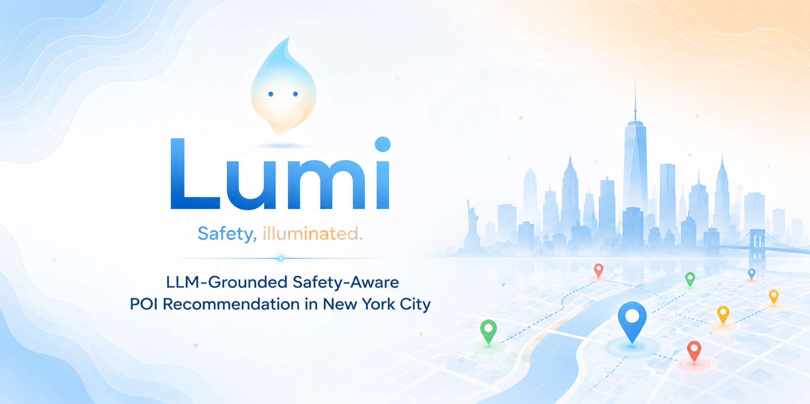

<p align="center">
  
</p>

#  Lumi

**Safety, illuminated.**

<h1 align="center">Lumi</h1>

<p align="center">
  <strong>Safety, illuminated.</strong><br>
  LLM-Grounded Safety-Aware POI Recommendation in New York City
</p>

<p align="center">
  <a href="...">📱 Try the Demo</a> •
  <a href="...">🎥 Watch Demo</a> •
  <a href="...">📄 Project Report</a>
</p>

[](https://drive.google.com/file/d/1KIxzQ7WzAbb1HnWteYhRWlUvTsUHNJ6g/view?usp=sharing)

[](https://www.youtube.com/watch?v=RG4KSjkFink)

Lumi is a research-driven mobile application that helps people discover places while incorporating **crime awareness** into the recommendation process.

Unlike traditional location-based recommendation systems that primarily optimize for popularity or proximity, Lumi combines **user intent**, **visit context**, and **urban safety information** to recommend places that better match the user's needs.

---

## ✨ Project Vision

Finding a place to visit is rarely only about *what* you want.

Who you're with, how cautious you want to be, and the characteristics of the surrounding area all influence whether a place feels like the right choice.

Lumi aims to make these considerations transparent by combining:

- 📍 Location context
- 👤 User profile
- 🚶 Visit context
- 🛡️ Crime-aware reasoning
- 💬 Explainable recommendations

The goal is **not to decide for the user**, but to provide recommendations together with understandable safety explanations that support informed decisions.

---

## Architecture

```
                ┌────────────────────┐
                │    Flutter App     │
                │  (Lumi Mobile UI)  │
                └─────────┬──────────┘
                          │
                   Secure WebSocket
                          │
                ┌─────────▼──────────┐
                │ Recommendation API │
                │  Context Builder   │
                │   Safety Engine    │
                └─────────┬──────────┘
                          │
                Crime & Urban Context
```

---

## Repositories

| Repository | Description |
|------------|-------------|
| 📱 **lumi-mobile-app** | Flutter mobile application |
| ⚙️ **lumi-backend** | WebSocket backend and recommendation service |

---

## Main Features

- Context-aware POI recommendation
- Crime-aware ranking
- Explainable recommendation reasoning
- Interactive map visualization
- Visit-specific safety preferences
- Local-only user profile storage
- Privacy-first design

---

## Current Status

Lumi is currently under active development as part of an academic research project exploring safety-aware recommendation systems.

Current work includes:

- Mobile application development
- Recommendation backend
- Crime data integration
- User experience design
- Explainable recommendation generation

---

## Technologies

### Mobile

- Flutter
- Google Maps
- RxDart
- WebSockets

### Backend

- Node.js + TypeScript
- WebSockets
- OpenAi for explainability
- Firebase Firestore for generated recommendations logs

### Data

- NYC Open Data
- Crime datasets
- Urban infrastructure data

---

## Research Focus

This project explores how contextual safety information can be incorporated into recommendation systems while maintaining:

- transparency
- user control
- privacy
- explainability

rather than replacing user decision making.

---

## License

This project is currently developed for research purposes.
